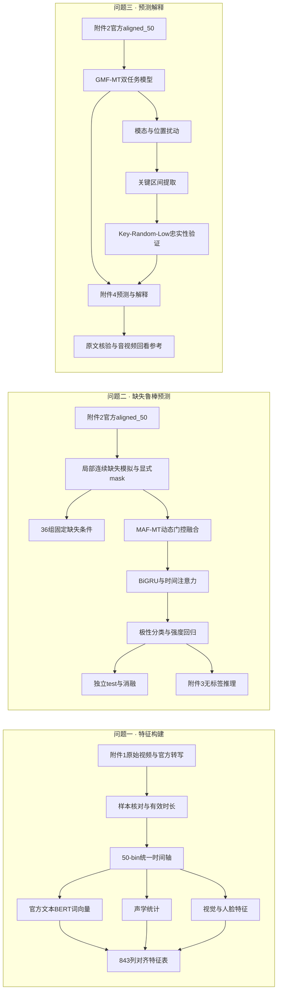

# 项目流程

这张可编辑流程图根据最终方法整理。问题一与问题二、三的官方特征接口是两条独立数据路径。

```mermaid
flowchart LR
  subgraph Q1[问题一 · 特征构建]
    A1[附件1原始视频与官方转写] --> A2[样本核对与有效时长]
    A2 --> A3[50-bin统一时间轴]
    A3 --> A4[官方文本BERT词向量]
    A3 --> A5[声学统计]
    A3 --> A6[视觉与人脸特征]
    A4 --> A7[843列对齐特征表]
    A5 --> A7
    A6 --> A7
  end
  subgraph Q2[问题二 · 缺失鲁棒预测]
    B1[附件2官方aligned_50] --> B2[局部连续缺失模拟与显式mask]
    B2 --> B3[36组固定缺失条件]
    B2 --> B4[MAF-MT动态门控融合]
    B4 --> B5[BiGRU与时间注意力]
    B5 --> B6[极性分类与强度回归]
    B6 --> B7[独立test与消融]
    B6 --> B8[附件3无标签推理]
  end
  subgraph Q3[问题三 · 预测解释]
    C1[附件2官方aligned_50] --> C2[GMF-MT双任务模型]
    C2 --> C3[模态与位置扰动]
    C3 --> C4[关键区间提取]
    C4 --> C5[Key-Random-Low忠实性验证]
    C2 --> C6[附件4预测与解释]
    C5 --> C6
    C6 --> C7[原文核验与音视频回看参考]
  end
```

问题一的 ASR 提供官方词与媒体之间的**时间参考**，不提供最终 BERT 语义内容。问题二、三的 `aligned_50` 来自官方附件，不能把问题一的媒体 50-bin 索引直接解释为附件 2/4 的物理秒数。
